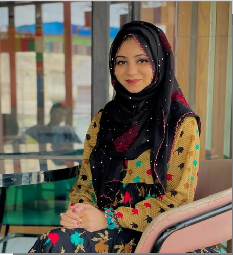

<html lang="en">
<head>
    <meta charset="UTF-8">
    <meta name="viewport" content="width=device-width, initial-scale=1.0">
    <title>Hajra Bibi</title>
    <link href="https://cdn.jsdelivr.net/npm/tailwindcss@2.2.19/dist/tailwind.min.css" rel="stylesheet">
    <link rel="stylesheet" href="https://cdnjs.cloudflare.com/ajax/libs/font-awesome/6.0.0-beta3/css/all.min.css">
    
    
</head>
<body class="bg-gray-50 text-gray-900 dark:bg-gray-900 dark:text-gray-100 font-sans">
    <!-- Navigation -->
    <nav class="bg-gradient text-white shadow-lg">
        

            

                

                    

                        <a href="#" class="flex items-center py-5 px-2 text-white hover:text-gray-200">
                            <svg class="w-6 h-6 mr-1" fill="none" stroke="currentColor" viewBox="0 0 24 24" xmlns="http://www.w3.org/2000/svg"><path stroke-linecap="round" stroke-linejoin="round" stroke-width="2" d="M13 10V3L4 14h7v7l9-11h-7z"></path></svg>
                            Portfolio
                        </a>
                    

                    

                        <a href="#hero" class="py-5 px-3 font-medium hover:text-gray-200 transition-all"><i class="fas fa-home"></i> Home</a>
                        <a href="#about" class="py-5 px-3 font-medium hover:text-gray-200 transition-all"><i class="fas fa-user"></i> About</a>
                        <a href="#skills" class="py-5 px-3 font-medium hover:text-gray-200 transition-all"><i class="fas fa-cogs"></i> Skills</a>
                        <a href="#contact" class="py-5 px-3 font-medium hover:text-gray-200 transition-all"><i class="fas fa-envelope"></i> Contact</a>
                    

                

                

                    <button onclick="toggleTheme()" class="p-2 rounded-full hover:bg-white hover:bg-opacity-20 transition-all">
                        <svg id="theme-toggle-dark" class="hidden w-5 h-5" fill="currentColor" viewBox="0 0 20 20" xmlns="http://www.w3.org/2000/svg"><path d="M17.293 13.293A8 8 0 016.707 2.707a8.001 8.001 0 1010.586 10.586z"></path></svg>
                        <svg id="theme-toggle-light" class="w-5 h-5" fill="currentColor" viewBox="0 0 20 20" xmlns="http://www.w3.org/2000/svg"><path d="M10 2a1 1 0 011 1v1a1 1 0 11-2 0V3a1 1 0 011-1zm4 8a4 4 0 11-8 0 4 4 0 018 0zm-.464 4.95l.707.707a1 1 0 001.414-1.414l-.707-.707a1 1 0 00-1.414 1.414zm2.12-10.607a1 1 0 010 1.414l-.706.707a1 1 0 11-1.414-1.414l.707-.707a1 1 0 011.414 0zM17 11a1 1 0 100-2h-1a1 1 0 100 2h1zm-7 4a1 1 0 011 1v1a1 1 0 11-2 0v-1a1 1 0 011-1zM5.05 6.464A1 1 0 106.465 5.05l-.708-.707a1 1 0 00-1.414 1.414l.707.707zm1.414 8.486l-.707.707a1 1 0 01-1.414-1.414l.707-.707a1 1 0 011.414 1.414zM4 11a1 1 0 100-2H3a1 1 0 000 2h1z"></path></svg>
                    </button>
                    

                        <button class="mobile-menu-button p-2 focus:outline-none">
                            <svg class="w-6 h-6" fill="none" stroke="currentColor" viewBox="0 0 24 24" xmlns="http://www.w3.org/2000/svg"><path stroke-linecap="round" stroke-linejoin="round" stroke-width="2" d="M4 6h16M4 12h16M4 18h16"></path></svg>
                        </button>
                    

                

            

        

        

            <a href="#hero" class="block py-2 px-4 text-sm hover:bg-white hover:bg-opacity-20 transition-all"><i class="fas fa-home"></i> Home</a>
            <a href="#about" class="block py-2 px-4 text-sm hover:bg-white hover:bg-opacity-20 transition-all"><i class="fas fa-user"></i> About</a>
            <a href="#skills" class="block py-2 px-4 text-sm hover:bg-white hover:bg-opacity-20 transition-all"><i class="fas fa-cogs"></i> Skills</a>
            <a href="#contact" class="block py-2 px-4 text-sm hover:bg-white hover:bg-opacity-20 transition-all"><i class="fas fa-envelope"></i> Contact</a>
        

    </nav>

    <!-- Hero Section -->
    <section id="hero" class="text-center py-20 px-4 bg-gradient text-white">
        

            <h1 class="text-4xl md:text-5xl font-bold mb-4">Hajra Bibi</h1>
            
Pharmacist | Skilled in Leadership and Problem Solving

            

                <a href="mailto:hajraikram555@gmail.com" class="text-white hover:text-gray-200 transition-all">
                    <i class="fas fa-envelope text-2xl"></i>
                </a>
                <a href="https://linkedin.com/in/hajra-ikram-235568211" target="_blank" class="text-white hover:text-gray-200 transition-all">
                    <i class="fab fa-linkedin text-2xl"></i>
                </a>
                <a href="PROFESSIONAL RESUME (2).pdf" download class="bg-white text-pink-600 hover:bg-gray-200 px-4 py-2 rounded-full font-medium transition-all">
                    <i class="fas fa-download"></i> Download CV
                </a>
            

        

    </section>

    <!-- About Section -->
    <section id="about" class="max-w-6xl mx-auto px-4 py-16">
        

            

                
            

            

                <h2 class="text-3xl font-bold mb-6">About Me</h2>
                
I am a dedicated pharmacist with a CGPA of 3.54/4, skilled in creating innovative ideas to drive organizational success. I am proficient in MS Word, problem-solving, leadership, and PyRx software.

                
My educational background includes a Pharm.D from Shifa College of Pharmaceutical Sciences, Islamabad. I have also participated in various medical camps and internships, enhancing my practical experience in the field.

                

                    <h3 class="text-xl font-semibold mb-2"><i class="fas fa-language"></i> Languages</h3>
                    

                        Urdu
                        English
                        Arabic
                    

                

                

                    <h3 class="text-xl font-semibold mb-2"><i class="fas fa-paint-brush"></i> Hobbies</h3>
                    

                        Writing
                        Sketching
                        Designing
                        Painting
                    

                

            

        

    </section>

    <!-- Skills Section -->
    <section id="skills" class="max-w-6xl mx-auto px-4 py-16">
        <h2 class="text-3xl font-bold text-center mb-12">My Skills</h2>
        

            

                

                    <i class="fas fa-file-word text-pink-600 dark:text-pink-300 text-3xl"></i>
                

                <h3 class="text-xl font-semibold mb-2 text-center">MS Word</h3>
            

            

                

                    <i class="fas fa-search text-pink-600 dark:text-pink-300 text-3xl"></i>
                

                <h3 class="text-xl font-semibold mb-2 text-center">Problem Solving</h3>
            

            

                

                    <i class="fas fa-users text-pink-600 dark:text-pink-300 text-3xl"></i>
                

                <h3 class="text-xl font-semibold mb-2 text-center">Leadership</h3>
            

            

                

                    <i class="fas fa-flask text-pink-600 dark:text-pink-300 text-3xl"></i>
                

                <h3 class="text-xl font-semibold mb-2 text-center">PyRx Software</h3>
            

        

    </section>

    <!-- Education and Experience Section -->
    <section class="max-w-6xl mx-auto px-4 py-16">
        <h2 class="text-3xl font-bold text-center mb-12">Education & Experience</h2>
        

            <h3 class="text-2xl font-semibold mb-4"><i class="fas fa-graduation-cap"></i> Education</h3>
            

                

                    <h4 class="font-semibold">Pharm.D</h4>
                    
Shifa College of Pharmaceutical Sciences, Islamabad (2017-2021)

                

                

                    <h4 class="font-semibold">HSSC</h4>
                    
Govt. Girls Higher Secondary School, Hassan Abdal (2015)

                

                

                    <h4 class="font-semibold">SSC</h4>
                    
Govt. Girls Higher Secondary School (2013)

                

            

        

        

            <h3 class="text-2xl font-semibold mb-4"><i class="fas fa-briefcase"></i> Experience</h3>
            

                

                    <h4 class="font-semibold">Internship</h4>
                    
Shifa International Hospital (SIH, Islamabad)

                

                

                    <h4 class="font-semibold">Medical Camps</h4>
                    
Participated in various medical camps

                

            

        

    </section>

    <!-- Certifications Section -->
    <section class="max-w-6xl mx-auto px-4 py-16">
        <h2 class="text-3xl font-bold text-center mb-12">Certifications</h2>
        

            

                
Annual Medication Management Conference (AMMC Shifa 2021)

            

            

                
Keeping Our Communities Safe: A Mutual Responsibility (GBPP 2nd International Conference Sep 2021)

            

            

                
Research 101 Workshop (STMU - Jan 11th, 2017)

            

            

                
Chem-Ceutics Exhibition (STMU - March 29th, 2019)

            

            

                
High Achievers Development Program (Youth Development Centre, Murree - 2015)

            

            

                
Certificate of Scholarship (PEEF)

            

        

    </section>

    <!-- Contact Section -->
    <section id="contact" class="bg-gradient text-white py-16">
        

            <h2 class="text-3xl font-bold mb-6">Get In Touch</h2>
            
I'm currently looking for new opportunities and would love to hear from you. Whether you have a project in mind or just want to connect, feel free to reach out!

            

                <a href="mailto:hajraikram555@gmail.com" class="hover:text-gray-200 transition-all">
                    <i class="fas fa-envelope"></i>
                </a>
                <a href="tel:+923225050178" class="hover:text-gray-200 transition-all">
                    <i class="fas fa-phone"></i>
                </a>
                <a href="https://linkedin.com/in/hajra-ikram-235568211" target="_blank" class="hover:text-gray-200 transition-all">
                    <i class="fab fa-linkedin"></i>
                </a>
            

        

    </section>

    <!-- Footer -->
    <footer class="bg-gray-800 dark:bg-gray-900 text-white py-8">
        

            

                

                    
&copy; 2025 Hajra Bibi. All rights reserved.

                

                

                    <a href="mailto:hajraikram555@gmail.com" class="hover:text-gray-300 transition-all">
                        <i class="fas fa-envelope"></i>
                    </a>
                    <a href="tel:+923225050178" class="hover:text-gray-300 transition-all">
                        <i class="fas fa-phone"></i>
                    </a>
                    <a href="https://linkedin.com/in/hajra-ikram-235568211" target="_blank" class="hover:text-gray-300 transition-all">
                        <i class="fab fa-linkedin"></i>
                    </a>
                

            

        

    </footer>

    
</body>
</html>
